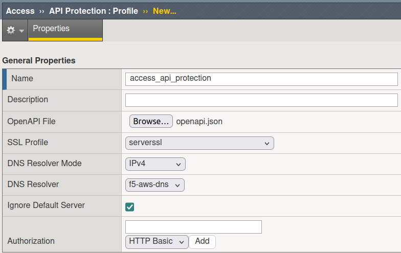
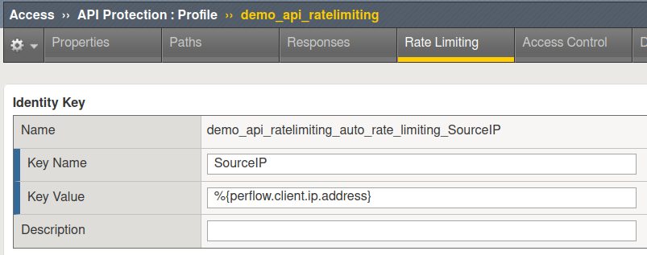
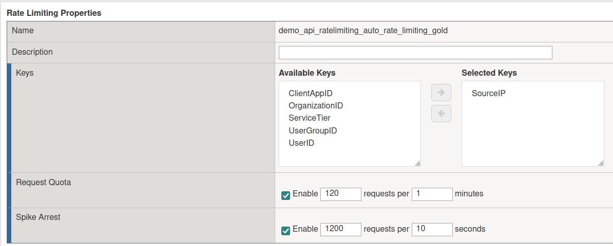
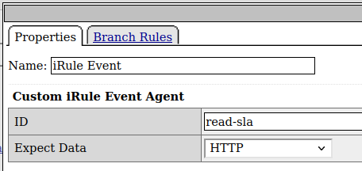
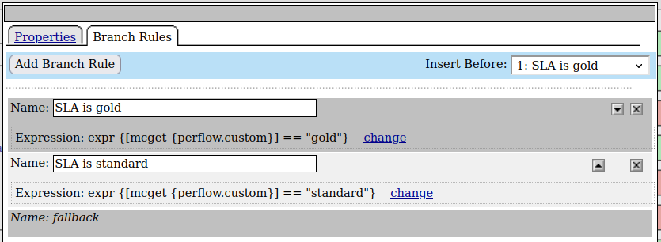
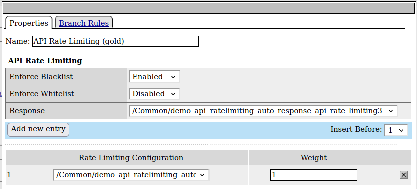
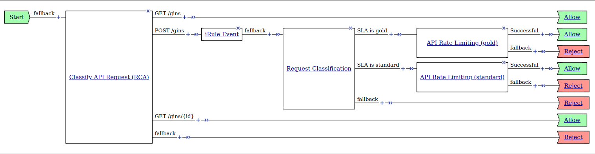

# Empowering B2B API Security: Enforcing Rate Limiting with BIG-IP APM and Custom iRules

## The problem: Unprotected API - Vulnerable to Overload Without Rate-Limiting Enforcement"

Our customer in the B2B sector is encountering a challenge with their public API. Despite having implemented a custom method for generating long-lived API keys, they find themselves unable to enforce rate-limiting effectively. This absence of rate-limiting mechanisms poses significant challenges, potentially resulting in the overloading of their system due to excessive requests or the exploitation of their API by unauthorized users. Without proper rate-limiting controls in place, the customer faces risks to both the performance and security of their API infrastructure, necessitating a solution to mitigate these concerns and ensure the smooth operation of their services for their customers. Our customer offers either a Gold or a Standard SLA to his customers.

## The solution: BIG-IP APM and Custom iRules for Effective Rate-Limiting

My solution involves leveraging the API Protection feature of BIG-IP APM in conjunction with a custom iRule. By utilizing this combination, our customer can effectively extract the API Keys from HTTP requests and enforce rate limiting on specific API endpoints. This approach empowers the customer to secure their SOAP API while efficiently managing and controlling access to critical endpoints, ensuring optimal performance and safeguarding against abuse or overload.

## Prerequisites

### BIG-IP version

For my lab I used BIG-IP 16.1.

### REST API

For developing a solution I needed an API. Since I was at a stage of my life, where I thought learning go might be beneficial, I found a simple boilerplate in Go and adjusted it to my liking. My API is available here: [Gin API for Managing Gin Spirits](https://github.com/webserverdude/go-gin-api).

My server has an OpenAPI file, you can either download it from my github or from [https://api-server-ip:8000/openapi.json](https://api-server-ip:8000/openapi.json).

## Setting up the solution

### API Protection profile

Start by creating an __API Protection profile__ in the __Access__ section, go to __Access  ››  API Protection : Profile__ and click __Create__.
Give it a name and upload the OpenAPI file. 
Choose SSL Profile, and DNS Resolver. Check the __Ignore Default Server__ box. Hit the __Save__ button.



#### Paths and Responses

On the __Paths__ tab everything is populated automatically from the OpenAPI file, you don't have to change anything here.
Also on the __Responses__ you have to change anything.

#### Rate Limiting

On the __Rate Limiting__ tab create a _Key_ with the following attributes:

* Name: <YourChoice>
* Key Name: SourceIP
* Key Value: `%{perflow.client.ip.address}`



Also on the __Rate Limiting__ tab create two _Properties_ with the following attributes:

* Property Gold
  * Name: <YourChoice_gold>
  * Keys: SourceIP
  * Request Quota: 120 / 1
  * Spike Arrest: 1200 / 10

* Property Standard
  * Name: <YourChoice_standard>
  * Keys: SourceIP
  * Request Quota: 60 / 1
  * Spike Arrest: 600 / 10



#### Access Control - Per Request Policy

Now this is the time consuming part. On the __Access Control__ tab click on _Edit..._ next to __Per Request Policy__. 
The __Classify API Request (RCA)__ item is created automatically from the OpenAPI file.
My customer wants Rate Limiting only on the POST requests. In order to use the iRule which we will take a look at later, we need an iRule Event. Add one with the __ID__ `read-sla`.



After the __iRule Event__ item add an item of the type __Request Classification__ with two branches.
One branch is for enforcing the _GOLD_ SLA the other one is for enforcing the _STANDARD_ SLA.
Go the the __Advanced__ view and add the following custom expressions:

* `expr {[mcget {perflow.custom}] == "gold"}` for the _GOLD_ SLA
* `expr {[mcget {perflow.custom}] == "standard"}` for the _STANDARD_ SLA



Finally, add for each branch one item of the type __API Rate Limiting__ with the following settings.

* Response: `demo_api_ratelimiting_auto_response_api_rate_limiting3`
* Rate Limiting Configuration: `demo_api_ratelimiting_auto_rate_limiting_gold` or ` demo_api_ratelimiting_auto_rate_limiting_standard`

__NOTE:__ I am using my object names here, make sure you change to the names you used. These are the objects you created on the __Rate Limiting__ tab.



#### Finished Per Request Policy

The full Per Request Policy should look like this.



You can for sure summarize the __Request Classification__ and the __API Rate Limiting__ items in a __Macro__ and also you can add logging to this Policy.

Now let's take a look at the iRule.

### iRule 

In the `HTTP_REQUEST` event the iRule searches for the HTTP header with the name ApiKey (case-insensitive), looks up the SLA value from the Data Group and saves the value to a variable.

The `ACCESS_PER_REQUEST_AGENT_EVENT` checks for the _agent ID_ we set in the __Per Request Policy__. Then it checks if the _agent ID_ is equal to `read-sla`, this way the iRule knows it should execute further and evaluate the SLA.
If true, it will set the custom variable `perflow.custom` to the SLA, either gold or standard.
This variable will then be used in the __Per Request Policy__.

Now we can attach both, the _iRule_ and the _API Protection profile_ to the Virtual Server.

#### iRule
```tcl
# Enable (1) or disable (0) logging globally
when RULE_INIT {
    set static::debug 1 
}

# Access and analyze the HTTP header data for SLA value
when HTTP_REQUEST {
    set sla [class lookup [HTTP::header value apikey] dg_apikeys]
    if { $static::debug } {log local0. "Made it to HTTP_REQUEST event with SLA value $sla."}
}

# Evaluate SLA value during per-request access policy execution
when ACCESS_PER_REQUEST_AGENT_EVENT {
    set id [ACCESS::perflow get perflow.irule_agent_id]
    if { $id eq "read-sla" } {
    if { $static::debug } {log local0. "Made it to iRule agent in perrequest policy with SLA value $sla."}
    ACCESS::perflow set perflow.custom "$sla"
    }
}
```

#### Data Group
For the iRule to work we need a __Data Group__ of the type __string__. This  Data Group we store the API Keys and the associated SLAs.

Here's how it looks on `tmsh`.

```bash
[root@ltm-apm-16:Active:Standalone] config # tmsh list ltm data-group internal dg_apikeys
ltm data-group internal dg_apikeys {
    records {
        9000 {
            data gold
        }
        9001 {
            data standard
        }
    }
    type string
}
```

## Testing the solution

The solution can be tested with a simple cURL command, just run the following command:

```bash
curl --location 'https://192.168.57.100/gins' \
--header 'apikey: 9001' \
--header 'Content-Type: application/json' \
--data '{"id": "4","Name": "No.3 London Dry Gin 0,7 Liter","Description": "No.3 London Dry Gin 0,7 Liter – Die No.1 für einen Dry Martini","price": 39.49}'
```

Now in the LTM log (if logging is enabled in the iRule), you should see:
```bash
Apr 28 13:03:42 ltm-apm-16.mylab.local info tmm3[17819]: Rule /Common/rule_api_ratelimiting <HTTP_REQUEST>: Made it to HTTP_REQUEST event with SLA value standard.
Apr 28 13:03:42 ltm-apm-16.mylab.local info tmm3[17819]: Rule /Common/rule_api_ratelimiting <ACCESS_PER_REQUEST_AGENT_EVENT>: Made it to iRule agent in perrequest policy with SLA value standard.
```

This should change with the API Key you use, either the SLA is Gold (9000) or Standard (9001).

In the APM log, you should see,